# CSCE435-PDDS
https://github.com/pres1017/CSCE435-PDDS
## 0.Group Number: 20

## 1. Group members:
1. Daniel Armenta
2. Prestone Malaer
3. Shurui Xu
4. Rahul Kumar

---

## 2. _due 10/25_ Sorting

### 2a _due 10/25_ Brief project description (what algorithms will you be comparing and on what architectures)
We will implement sorting algorithms and measure their performance on MPI and CUDA.
- Bitonic(CUDA)
- Bitonic(MPI)
- Merge sort (CUDA)
- Merge sort (MPI)
- Enumeration Sort (CUDA)
- Enumeration Sort (MPI)
- Bubble Sort (CUDA)
- Bubble Sort (MPI)

### 2b. Pseudocode for each parallel algorithm
Enumeration Sort (MPI)
```
MPI_Bcast(unsorted_array) //broadcast unsorted array to all threads
Local_sorted_indices[]  //empty
Sorted_array[] //empty
Unsorted_array[]  //filled

X = size/numprocs
For each section the thread with rank i handles (rank*x<i<(rank+1)*x):
	Count = 0 //sorted index of each element in the array
	For element j in the section, loop through the entire unsorted array:
		If array[i]>array[j] or (array[i]==array[j] and index i > index j):
			Count += 1
	local _unsorted_indices[i-rank*x] = count
MPI_Gather(local_sorted_indices, sorted_indices) 
In the master process (numproc = 0):
	Unsorted_arr_cpy[] = unsorted_array
	For each element i in the sorted array:
		Sorted_array[sorted_indices[i]] = Unsorted_arr_cpy[I]
```
Enumeration Sort (CUDA) 
```
malloc(host memory)
cudaMalloc(device memory)
cudaMemcpy(host_to_device unsorted array)
kernel enumeration_sort<<<BLOCKS, THREADS>>>(device_input, device_output, NUM_VALS);
cudaMemcpy(device_to_host sorted array)
	
enumeration_sort():
	if 'index' is within bounds of the array then
		Initialize 'rank' to zero.
		  For each element 'i' in the array:
		    If the current element is greater than element in the array or in a special case equal but greater in index:
		      Increase 'rank' by one.
		    End if
		  End for
		Place current element in 'output' at position 'rank'.
	END IF
```
Bubble/Odd-Even Sort (MPI)
```
bubble(local_arr, size_local_arr) {
    holder_arr = [size_local_arr]
    for(0 to num_processors-1) {
        if (taskid % 2 == 1 and num_processors % 2 == 1) { 
            if( in odd phase) { 
                send local_arr to process taskid + 1 using MPI_Send
                receive local_arr from process taskid + 1 using MPI_Recv and put into holder_arr variable
                this process keeps the lower half of numbers from local_arr + holder_arr
            }
            else if (in even phase and taskid != num_processors - 1) {//in even phase - exclude last
                send local_arr to process taskid - 1 using MPI_Send
                receive local_arr from process taskid - 1 using MPI_Recv and put into holder_arr variable
                this process keeps the higher half of numbers from local_arr + holder_arr

            }
        }
        // first and last processes do not get a pair
        else if(taskid % 2 == 1 && num_processors % 2 == 0) {

            if (in odd phase and rank != numtasks - 1) { 
                send local_arr to process taskid + 1 using MPI_Send
                receive local_arr from process taskid + 1 using MPI_Recv and put into holder_arr variable
                this process keeps the lower half of numbers from local_arr + holder_arr
            }
            else if (in even phase) { 
                send local_arr to process taskid - 1 using MPI_Send
                receive local_arr from process taskid - 1 using MPI_Recv and put into holder_arr variable
                this process keeps the higher half of numbers from local_arr + holder_arr
            }
        }

        else if(taskid % 2 == 0 && num_processors % 2 == 1) {

            if (in odd phase and taskid != 0) { 
                send local_arr to process taskid - 1 using MPI_Send
                receive local_arr from process taskid - 1 using MPI_Recv and put into holder_arr variable
                this process keeps the higher half of numbers from local_arr + holder_arr
            }
            else if (in even phase and taskid != numtasks - 1) { //in even phase - exclude last
                send local_arr to process taskid + 1 using MPI_Send
                receive local_arr from process taskid + 1 using MPI_Recv and put into holder_arr variable
                this process keeps the lower half of numbers from local_arr + holder_arr
            }
        }
        else { // taskid % 2 == 0 and num_processors % 2 == 0  
            if (in odd phase and taskid != 0) { 
                send local_arr to process taskid - 1 using MPI_Send
                receive local_arr from process taskid - 1 using MPI_Recv and put into holder_arr variable
                this process keeps the higher half of numbers from local_arr + holder_arr
            }
            else if (in even phase) { 
                send local_arr to process taskid + 1 using MPI_Send
                receive local_arr from process taskid + 1 using MPI_Recv and put into holder_arr variable
                this process keeps the lower half of numbers from local_arr + holder_arr
            }
        }
    }
    gather all the arrays into master using MPI_Gather
}
```
Bubble/Odd-Even Sort (CUDA)
```
malloc(host memory)
cudaMalloc(device memory)
cudaMemcpy(host_to_device unsorted array)
kernel oddEvenSort<<<BLOCKS, THREADS>>>(unsorted_array, NUM_VALS);
cudaMemcpy(device_to_host sorted array)


oddEvenSort(unsorted_array, size) {
    int tid //thread id
    int step // Total number of threads in block
    int swap;

    for (0 to size-1) {
        for (j = tid; j < size - 1; j += step) {
            if (in even phase) { // Even phase
                if (j is even and data[j] > data[j + 1]) {
                    // Swap adjacent elements
                    swap = data[j];
                    data[j] = data[j + 1];
                    data[j + 1] = swap;
                }
            } else { // Odd phase
                if (j is odd and data[j] > data[j + 1]) {
                    // Swap adjacent elements
                    swap = data[j];
                    data[j] = data[j + 1];
                    data[j + 1] = swap;
                }
            }
        }

        __syncthreads(); // Synchronize threads within the block
    }
}

```
Bitonic Sort CUDA
```
bitonic_sort_step(dev_values,j,k){
  i, ixj;
  i equal to threadIdx.x + blockDim.x * blockIdx.x;
  ixj equal to i^j;
  

  if ixj greater than i {
    if i and k ==0 {
      if (dev_values at i is greater than dev_values at ixj) {
        temp = dev_values at i;
        dev_values at i = dev_values at ixj;
        dev_values at ixj = temp;
      }
    }
    if i and k not equal to 0 {
      if (dev_values at i is less than dev_values at ixj) {
        temp equal to dev_values[i];
        dev_values at i equal to dev_valuesat ixj;
        dev_values at ixj equal to temp;
      }
    }
  }
  }

void bitonic_sort(values)
{
  dev_values;
  size = NUM_VALS  times sizeof(float);
  cudaEvent_t start, stop;

  cudaMalloc((void**) &dev_values, size);
  
  cudaEventCreate(&start);
  cudaEventCreate(&stop);

  CALI_MARK_BEGIN("comm");

  if (size less than COMM_SMALL_THRESHOLD)
  	CALI_MARK_BEGIN("comm_small");
  else 
  	CALI_MARK_BEGIN("comm_large");
  

  CALI_MARK_BEGIN(cudaMemcpy_host_to_device);
  cudaEventRecord(start);
  cudaMemcpy(dev_values, values, size, cudaMemcpyHostToDevice);
  cudaEventRecord(stop);
  CALI_MARK_END(cudaMemcpy_host_to_device);

 if (size less than COMM_SMALL_THRESHOLD)
  	CALI_MARK_END("comm_small");
  else 
  	CALI_MARK_END("comm_large");

  CALI_MARK_END("comm");

  cudaEventSynchronize(stop);
  cudaEventElapsedTime(&cudaMemcpy_host_to_device_time_calculated, start, stop);

  blocks;
  threads;
  
  j, k;

  CALI_MARK_BEGIN("comp");
  
  if (threads less than COMP_SMALL_THRESHOLD) 
    CALI_MARK_BEGIN("comp_small");
  else 
    CALI_MARK_BEGIN("comp_large");


  CALI_MARK_BEGIN(bitonic_sort_step_region);
  cudaEventRecord(start);
  for k = 2, k less than number of vals; k >> 1
    for (j=k>>1; j>0; j=j>>1) {
      
      bitonic_sort_step<<<blocks, threads>>>(dev_values, j, k);
      kernel_calls++;
    }
  }
  cudaEventRecord(stop);
  CALI_MARK_END(bitonic_sort_step_region);

  if (threads less than COMP_SMALL_THRESHOLD) 
    CALI_MARK_END("comp_small");
  else 
    CALI_MARK_END("comp_large");
    
  CALI_MARK_END("comp");

  cudaDeviceSynchronize();
  cudaEventElapsedTime(&bitonic_sort_step_time_calculated, start, stop);
  
  
  //MEM COPY FROM DEVICE TO HOST
  CALI_MARK_BEGIN("comm");

  if (size less than COMM_SMALL_THRESHOLD)
  	CALI_MARK_BEGIN("comm_small");
  else 
  	CALI_MARK_BEGIN("comm_large");

  CALI_MARK_BEGIN(cudaMemcpy_device_to_host);
  cudaEventRecord(start);
  cudaMemcpy(values, dev_values, size, cudaMemcpyDeviceToHost);
  cudaEventRecord(stop);
  CALI_MARK_END(cudaMemcpy_device_to_host);

  if (size less than COMM_SMALL_THRESHOLD)
  	CALI_MARK_END("comm_small");
  else 
  	CALI_MARK_END("comm_large");

  CALI_MARK_END("comm");

  cudaEventSynchronize(stop);
  cudaEventElapsedTime(&cudaMemcpy_device_to_host_time_calculated, start, stop);
  
  cudaFree(dev_values);
  cudaEventDestroy(start);
  cudaEventDestroy(stop);
}

```


Bitonic Sort MPI 

```

bitonic_sort(d, s, sizeBatch, elementPerProcess) {
    i, j, k;
    CALI_MARK_BEGIN("comp");
    CALI_MARK_BEGIN("comp_large");
    for (k equal to 2; k less than or equal to sizeBatch; k = 2 * k) {
        for (j =equal to k >> 1; j > 0; j equal to j >> 1) {
            for (i = 0; i less than sizeBatch; i++) {
                ixj equal to  i ^ j;
                if (ixj greater than i) {
                    if ((i and k) == 0 and d[s + i] > d[s + ixj]) {
                        temp equal to d[s + i];
                        d[s + i] equal to  d[s + ixj];
                        d[s + ixj] equal to temp;
                    }
                    if ((i and k) != 0 and d[s + i] less than d[s + ixj]) {
                        temp equal to d[s + i];
                        d[s + i] equal to d[s + ixj];
                        d[s + ixj] equal to temp;
                    }
                }
            }
        }
    }
    CALI_MARK_END("comp_large");
    CALI_MARK_END("comp");
}


exchange(d, sizeBatch, partner) {
    rank;
    MPI_Comm_rank(MPI_COMM_WORLD, &rank);
    partner_data = (float*)malloc(sizeof(float) * sizeBatch / 2);

    if (rank == partner) 
        memcpy(partner_data, d + (rank < partner ? 0 : sizeBatch / 2), sizeof(float) * sizeBatch / 2);
    


    MPI_Barrier(MPI_COMM_WORLD);

    if (rank less than partner) 
        CALI_MARK_BEGIN("comm_large");
        MPI_Send(d + sizeBatch / 2, sizeBatch / 2, MPI_FLOAT, partner, 0, MPI_COMM_WORLD);
    

    MPI_Bcast(partner_data, sizeBatch / 2, MPI_FLOAT, partner, MPI_COMM_WORLD);

    if (rank greater than or equal to partner) 
        CALI_MARK_BEGIN("comm_small");
        MPI_Send(d, sizeBatch / 2, MPI_FLOAT, partner, 0, MPI_COMM_WORLD);
    

    if (rank less than partner) 
        memcpy(d + sizeBatch / 2, partner_data, sizeof(float) * sizeBatch / 2);
        CALI_MARK_END("comm_large");
    else 
        memcpy(d, partner_data, sizeof(float) * sizeBatch / 2);
        CALI_MARK_END("comm_small");
    

    free(partner_data);
}

```


MERGESORT MPI
```
main():
    MPI_Init(&argc, &argv);


    int rank, size;
    MPI_Comm_rank(MPI_COMM_WORLD, &rank);
    MPI_Comm_size(MPI_COMM_WORLD, &size);


    const int n = std::stoi(arg);
    int array[n];


    MPI_Bcast(array, n, MPI_INT, 0, MPI_COMM_WORLD);


    int local_n = n / size;
    int local_array[local_n];


    MPI_Scatter(array, local_n, MPI_INT, local_array, local_n, MPI_INT, 0, MPI_COMM_WORLD);


    mergeSort(local_array, 0, local_n - 1);


    MPI_Gather(local_array, local_n, MPI_INT, array, local_n, MPI_INT, 0, MPI_COMM_WORLD);


/*
Scatters the arrays to the threads
Performs MergeSort
Gathers the arrays back in main
*/
	
```

MERGESORT CUDA
```
void parallelMergeSort(int *a, int *b, int n) {
    int *dev_a, *dev_b;
    cudaMalloc((void**)&dev_a, n * sizeof(int));
    cudaMalloc((void**)&dev_b, n * sizeof(int));


    cudaMemcpy(dev_a, a, n * sizeof(int), cudaMemcpyHostToDevice);


    int blockSize = 256;
    int numBlocks = (n + blockSize - 1) / blockSize;
   
    for (int i = 2; i <= n; i *= 2) {
        for (int j = 0; j < n; j += i) {
            CALIPER_MARK_BEGIN(small_comp);
            merge<<<numBlocks, blockSize>>>(dev_a, dev_b, dev_b, i);
            cudaDeviceSynchronize();
            CALIPER_MARK_END(small_comp);
        }
    }


    cudaMemcpy(a, dev_a, n * sizeof(int), cudaMemcpyDeviceToHost);
    cudaFree(dev_a);
    cudaFree(dev_b);
}


int main() {
    cali::ConfigManager mgr;
    mgr.start();


    int a[] = {12, 11, 13, 5, 6, 7};
    int n = sizeof(a)/sizeof(a[0]);
    int *b = (int*)malloc(n * sizeof(int));


    parallelMergeSort(a, b, n);


    free(b);
```

### 2c. Evaluation plan - what and how will you measure and compare
```
Input sizes: 2^16, 2^20, 2^24
Input types: Float
Strong scaling (same problem size, increase number of processors/nodes)
Weak scaling (increase problem size, increase number of processors)
Number of threads in a block on the GPU
```
## 3. Project implementation

Please see GitHub branches for algorithm implementations and Caliper files. 

## 4. Performance Evaluation

### Enumeration Sort - Shurui Xu
From the current implementations of Enumeration Sort, there is inefficiency introduced in a lot of places. 
For MPI, the average time for running each procs stays constant even when increasing the procs count while the input size stays constant. However, there is a noticeable drop runtime when 2 nodes are requested instead of 1. The performance of 2 nodes is twice that of 1 node, regardless of the number of procs. There is most likely a problem in the way I am currently submitting the job files. I will look into the problem once Grace is fixed due to the faulty nodes.

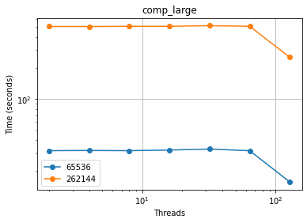


As for CUDA, the increase in threads (while the input size stays constant) did not seem to decrease the computation time by much. This is due to the inefficiencies of the enumeration sort algorithm, making it use a lot of memory and not a lot of processing power. 

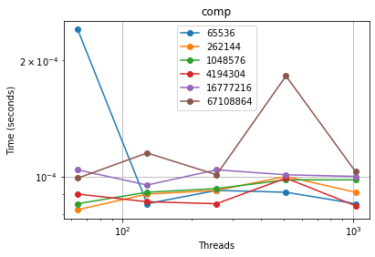

Due to the bugs I have introduced, there is currently no speedup, unless more nodes are introduced for MPI. Weak scaling or strong scaling is not apparent in the current implementation of the Enumeration sort.

### Merge Sort - Preston Malaer

The current implementation of MergeSort in MPI is incredibly inefficient, suggesting either an issue with the implementation itself or the way I'm running it. The more processes that are added, the worse my implementation performs.

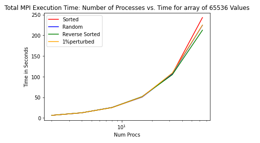

The MergeSort implementation of CUDA similarly saw no benefits from parallelism. Performance stayed the same, regardless of how many threads were added. Once again, this suggests either an issue with the implementation itself or the way the hardware was being utilized. 

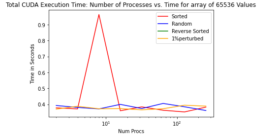

### Odd-even Sort - Daniel Armenta

The MPI implementation of the Odd-even Sort contains a lot of overhead. Because processes do not share memory, they have to send/receive between each other at every odd-even step. According to the graph, this overhead gets worst as the number of processes increases. 

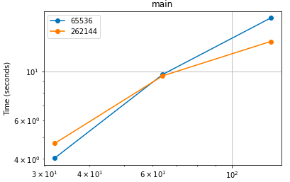

The CUDA implementation of the Odd-even sort, on the other hand, performs way better than the MPI. Because threads share memory, there is no need to explicitly send or receive data. This is also backed by the graph below. The time of main is much lower than the MPI implementation and seems to improve as we increase the number of threads.

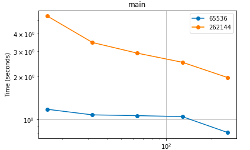

### Bitonic Sort - Rahul Kumar

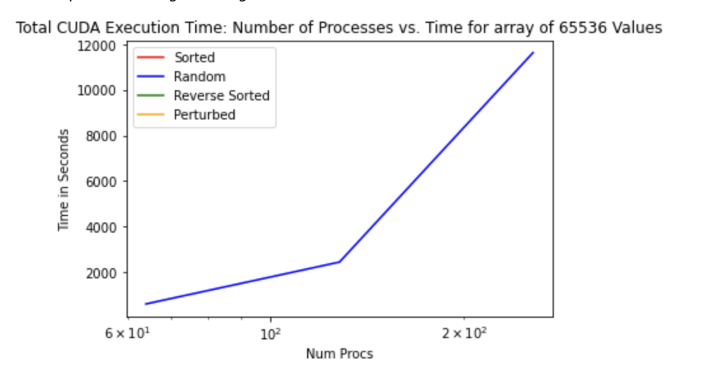

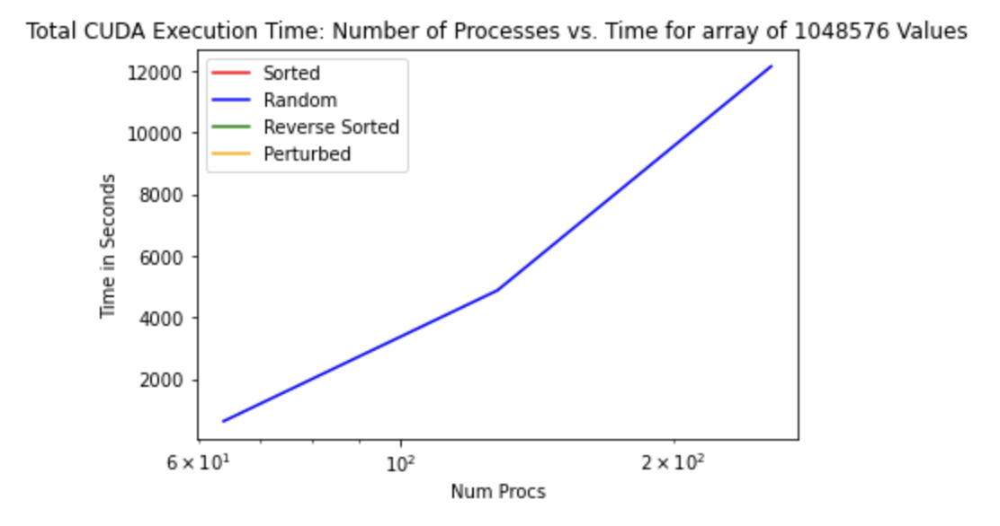

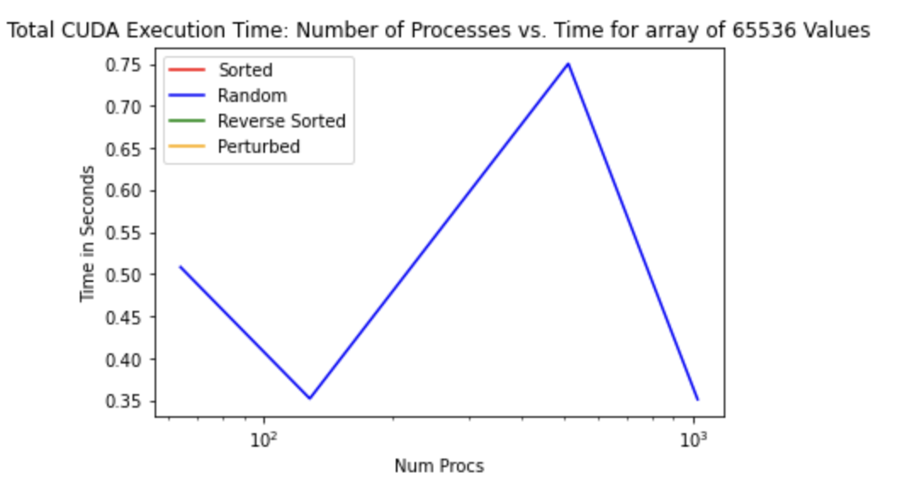


## 6. Final Report on Sorting Algorithm Performance

### Bitonic Sort - Rahul Kumar

For the final evaulation of the Bitonic Sort Performance, I focused on how the performance changes between strong and weak scaling, and if is there any speedup present during strong scaling. 

CUDA - 
My CUDA implementation relies on sending a sort step to the CUDA kernal which will run on the GPU. The sort function will allocate memory on the GPU, then copy the data. After copuing the data, the sorting kernal will be executed in individual steps, and then finally copied back to the host.

MPI-


Weak Scaling - CUDA


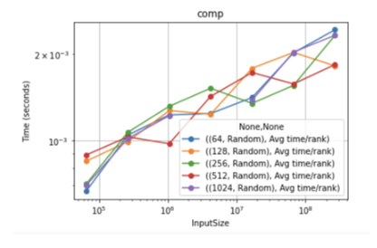

Strong Scaling - CUDA


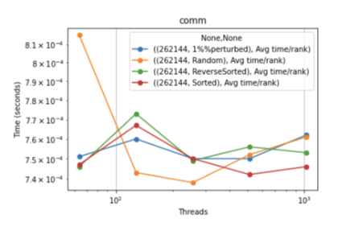

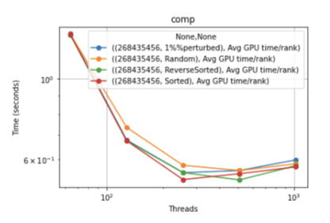

Speedup - CUDA


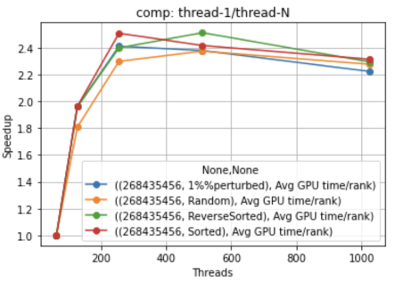

Weak Scaling - MPI


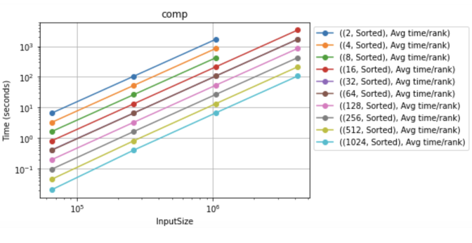

Strong Scaling - MPI


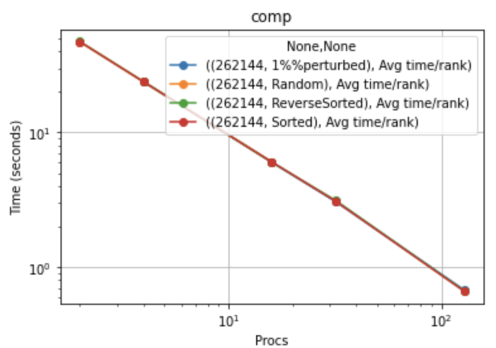

Speedup - MPI


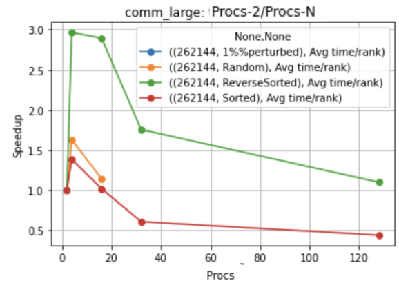


